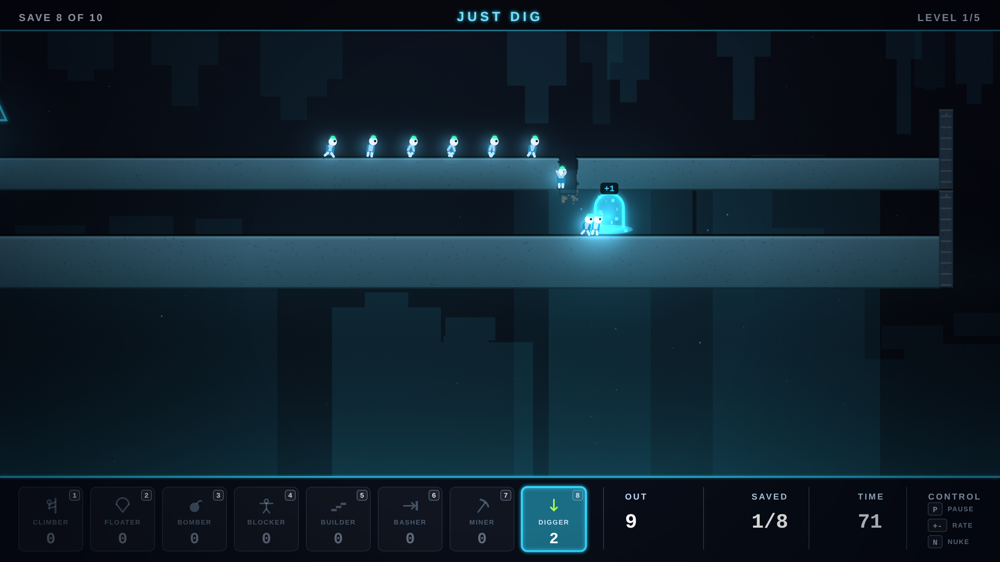

# NEONLINGS

Fifth game in the harsh-critic-loop series, after
[NEONOID](https://github.com/melvincarvalho/neonoid),
[NEON MINER](https://github.com/melvincarvalho/neonminer),
[NEODROID](https://github.com/melvincarvalho/neodroid) and
[NEON DASH](https://github.com/melvincarvalho/neondash). A Lemmings tribute:
neonlings drip from a hatch and march mindlessly toward the exit — or the
abyss — across five levels of pixel-destructible terrain, and you spend a
finite pool of eight classic skills (climber, floater, bomber, blocker,
builder, basher, miner, digger) to save the quota. Original levels and
creatures — the real Lemmings (DMA Design, 1991) is copyrighted, and revered
here.

**Play it: <https://melvincarvalho.github.io/neonlings/>**



**There are no assets.** Every pixel and every sound is generated from code.
Two files: `index.html`, `game.js`. Pick a skill, click a neonling. A/D or
screen edge scrolls. P pauses (assignment still allowed — the classic
tactic), +/- controls the hatch rate, N nukes.

```bash
python3 -m http.server 8000   # or just open index.html
```

## The experiment

Same pipeline as the first four games — one owner builds, deterministic
`?shot=` captures, four harsh sub-agent critics (three visual lenses plus a
Lemmings-fidelity judge), consensus fixes, re-score to plateau — with the
harness's final destination reached: **levels as theorems**.

**Every level ships with a machine-checked proof.** `tools/playtest.sh` runs
a three-sided acceptance test over all five levels, headlessly, every build:

- the **authored solution** must SOLVE (quota met, margin reported),
- a **null run** with no skills must FAIL (skills are load-bearing),
- **per-skill ablations** — the solution replayed with one skill deleted —
  must FAIL.

Plus a **mechanism proof**: a scripted micro-scenario in which a blocker is
freed by a digger carving away the ground beneath it — the canon release
rule, machine-verified (`released: 1`, both lings exit).

Final telemetry: **5/5 solutions SOLVED** (margins +2, +1, +2, +2, 0),
**5/5 nulls FAILED, 10/10 ablations FAILED** — every provisioned skill on
every level is load-bearing, no dead weight in any pool. Each proof carries
an assignment event log (time, skill, x, ling id), so every claim is
auditable.

**Physics is the constitution.** The round-1 fidelity critic caught the splat
threshold quietly tuned so the levels would pass. The rule since: constants
are canon-proportioned (fall speed 3× walk speed, splat window ≈1.2s of
falling, climb at walk parity, 12-brick builders at the canon 26.6° stair)
and frozen; when a proof fails, the *level* gets redesigned, never the
constants. Four levels were rebuilt under that rule — and the miner itself
was added because the round-2 critic demanded the eighth canon skill with a
level where its ablation fails.

## Scores

| round | composition | game-feel | HUD | visual mean | Lemmings fidelity |
|---|---|---|---|---|---|
| 1 | 4.2 | 2.9 | 5.5 | **4.2** | 6.4 |
| 2 | 4.8 | 4.4 | 6.5 | **5.2** | 7.7 |
| 3 (final) | 5.7 | 6.1 | 7.5 | **6.4** | **8.6** |

Final-round verdicts: fidelity — *"an eight-skill Lemmings core proven
solvable, proven breakable, and retuned to 1991's own ratios… the simulation
is now Lemmings; the production around it is still a tribute."* HUD — *"a
disciplined neon HUD that finally behaves like a product."* Game-feel —
*"polished bones, small muscles."* Composition — *"NEONLINGS finally looks
intentional, but not yet expensive"* (blind A/B vs a commercial remake:
~20/80 overall, ~45/55 on HUD alone). Eleven small post-panel fixes (limb
stroke weight, splat shake, stride continuity through turnarounds, parade
arms, pickaxe miner icon, pointer cursor over UI, removal of the auto-switch
misclick trap, bomber-shot staging cap, and more) were applied after the
final scores; the numbers above are the panel's, not post-fix.

## Honest assessment

- **The release-rate dial is a toggle** (+/- boost) vs canon's continuous
  1–99 ratchet, and there is no cursor readout or assignment priority —
  the fidelity critic's two "last missing canon controls".
- **No music** — SFX only.
- **Step-up is 9px** (canon is ~6). Raised so bomber craters can't trap a
  crowd; kept after the miner arrived because the crater-walkability
  interaction is load-bearing in two levels.
- **Five levels vs the original's 120**, one difficulty tier, binary
  release-rate control instead of canon's continuous 1–99.
- **Level 5 solves at margin 0** — deterministic and machine-verified, but
  a one-frame physics change would break the finale's proof before any
  other level's. The harness would catch it; the margin is still zero.
- Staged evidence shots are separate deterministic runs, not one continuous
  playthrough.

## Process notes

1. **The ablation harness found real design flaws, not just balance.** Level
   3's ablate-digger run once SOLVED because a floor tweak had made an
   edge-drop legal; level 5's ablate-blocker and ablate-bomber SOLVED at
   margin 0 for a full round — "insurance" that paid out identically to no
   insurance. The fix was structural both times (a steel dead-end; a quota
   raise plus an overhang lip), and the ablations now fail decisively.
2. **The physics-tuning incident** (splat threshold quietly raised to make
   levels pass) is the series' clearest lesson: when the proof harness
   disagreed with the physics, the physics lost.
3. **The miner shipped with a 1px-floor-sliver bug** its first hour: the
   bore circle grazed the ledge's bottom row at a single pixel, the crowd
   stood on the sliver, and the miner strolled back out of its own mine.
   Found by time-bisecting the proof harness's ling snapshots — not by
   eyeballing pixels.
4. **Canon details cascade.** The climber bonk-reversal (a bonked climber
   falls away from the wall, turned around) was implemented because without
   it level 5's contained crowd entered an infinite climb-bonk-climb loop —
   the proof caught a genuine canon omission.

## License

Copyright © 2026 Melvin Carvalho.

Licensed under the [GNU Affero General Public License v3.0 or later](LICENSE)
(AGPL-3.0-or-later).
